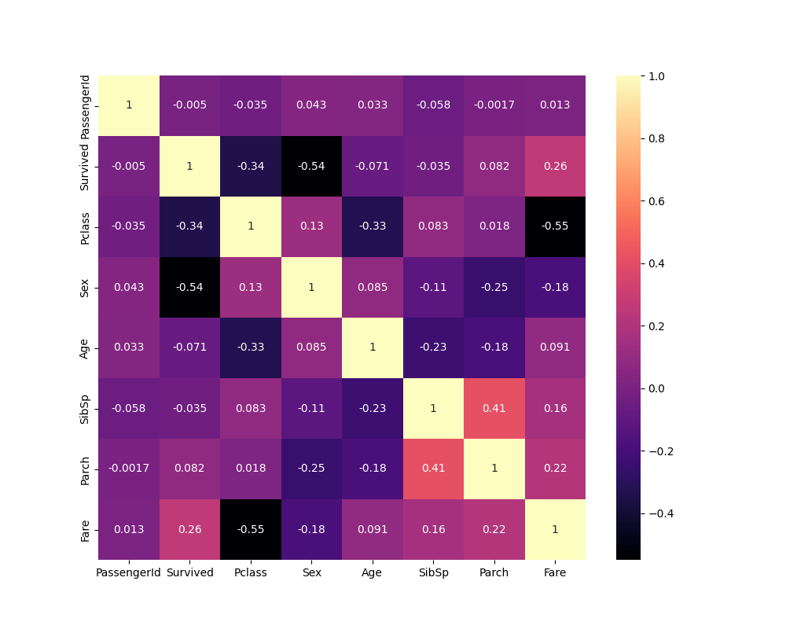

# Classification Model Comparison 
## Overview 
For this project, I wanted to use what I learned from my "Machine Learning Fundamentals" module during year one of my bachelor's degree. I took a 'Titanic Dataset' and used the data to predict whether or not a passenger survived. I decided to use 3 classification models to achieve this; Logistic Regression, a Multi-Layer-Perceptron, and a K Nearest Neighbours Classifier. 
### Data Analysis 
I knew from taking the ML Fundamentals class, that a model is only as good as the data you give it. For this reason, the first thing I did was look at what the dataset was showing me. Using the Pandas library, I used functions such as ```.head()```, ```.info()``` and ```.describe()``` to understand what features were available and what values were used. 
### Data Cleaning 
Before going any further, I knew for what I wanted to achieve that some features would be redundant (such as passenger ID and ticket number). These fields would have no effect on a persons survival, so these features were removed from the dataset. 

Again, with the use of Pandas, I was able to see that the "Age" feature had missing / NAN values. Using the ```.fillna()``` function, I was able to fill these missing values with the average age value, which I found sufficient for this use case. Luckily, there were minimal missing values here, which I believe would not skew the data much, if at all.  

Finally, a potentially important and informative feature, Sex, used a String data type for its values. This would not translate when predicting data, so I changed the format to a binary representation (1 for Male, 0 for Female). I achieved this through a simple conditional statement, and changing the ```boolean``` to an ```int``` data type (```True``` translates to 1, ```False``` to 0).  
### Correlation Heatmap 
To further understand the data, I used a correlation heatmap to visually see the highest correlating features. I achieved this through using the Pandas function ```.corr()``` and visualised the correlation matrix with MatPlotLib and Seaborn libraries. This helped me see the highest correlating features which I would use for my X values in my models.  
 
### Logistic Regression 
For my first model I used a Logistic regression, which achieved an accuracy score of 0.799 and a root mean squared error of 0.448. Given the number of features and the amount of data (891 rows), this was a good result overall.  
### Multi-Layer Perceptron 
This model was my second approach, and to start, the model performed slightly worse than the Logistic regression model. For the data, the MLP Classifier was too complex and this affected its ability to correctly classify whether a passenger survived. However, after using the ```StandardScaler()``` function from scikit-learn, the results improved. 
### K Nearest Neighbours 
The final approach I used saw a similar effect when using ```StandardScaler()```, initially the model performed on par with the neural network. This is due to the model choosing its 'neighbours' based on high variance features such as 'Fare'. Features like this mean there are values that are vastly larger / smaller than actual similar passengers, but the model thinks these passengers are more different than what they actually are because of the variance. In the end, after scaling, this model proved to have the highest accuracy score. 
## Results
| Model | Accuracy | RMSE |
|---|---|---|
| Logistic Regression | 79.9% | 0.448 |
| Neural Network (unscaled) | 78.21% | 0.467 |
| Neural Network (scaled) | 82.1% | 0.423 |
| KNN (unscaled) | 68.71% | 0.559 |
| KNN (scaled) | 82.7% | 0.416 |
## Conclusion 
To conclude, there is not always a 'best' model to always refer to when creating a classification or prediction model. The data you feed to model is always the most important factor, secondary to the model choice. This was proved by using the MLP and KNN classifiers before and after scaling the data with ```StandardScaler()```; the improvement was significant - A big leap of nearly 14% accuracy when scaling the KNN model, and a modest but still notable improvement for the Neural Network, just shy of 4% improvement. I have learnt from this project more about data analysis, cleaning, and feature selection, as well as the importance of selecting a suitable model based on the type of classifications or predictions you wish to achieve.
### Setup
```bash
pip install -r requirements.txt
python MachineLearningProject.py
```